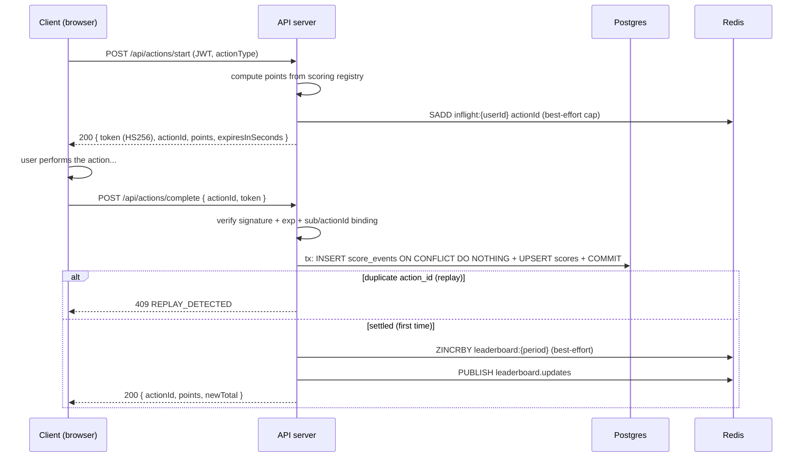
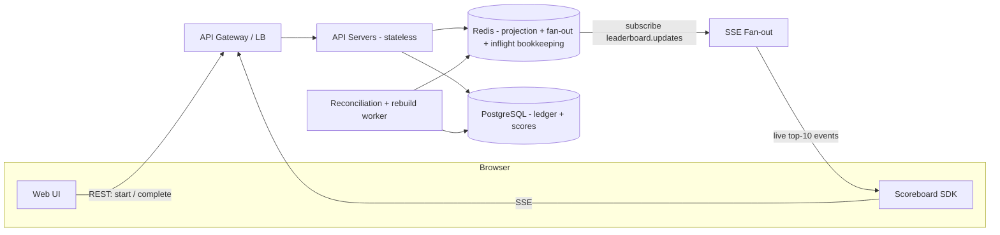
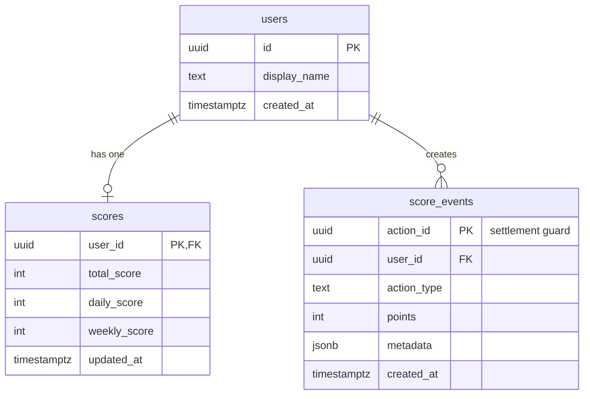

# Problem 6 — Design

The complete design for the live scoreboard. Diagrams and testing strategy
live in [`DIAGRAMS.md`](./DIAGRAMS.md); the ticket breakdown in
[`IMPLEMENTATION_PLAN.md`](./IMPLEMENTATION_PLAN.md).

## Table of contents

- [1. Requirements](#1-requirements)
- [2. Core anti-cheat mechanism: server-decided points + ledger-first settlement](#2-core-anti-cheat-mechanism-server-decided-points--ledger-first-settlement)
- [3. High-level architecture](#3-high-level-architecture)
- [4. API design](#4-api-design)
- [5. Data model](#5-data-model)
- [6. SSE protocol](#6-sse-protocol)
- [7. Failure handling & edge cases](#7-failure-handling--edge-cases)
- [8. Scale considerations](#8-scale-considerations)
- [9. Threat model](#9-threat-model)
- [10. Decisions & trade-offs](#10-decisions--trade-offs)
- [11. Out-of-scope follow-ups](#11-out-of-scope-follow-ups)

---

## 1. Requirements

### Functional

- F1. The scoreboard displays the **top 10 users by total score**, live.
- F2. Completing a score event updates the user's total score.
- F3. The frontend gets real-time updates without polling on every render.
- F4. Clients reconnecting (flaky network) do not miss updates or double-count
      a completed score event.

### Non-functional

- N1. **Security**: a user must not be able to add points at will. The server
      decides how many points an action is worth.
- N2. **Consistency**: the leaderboard must not show phantom scores (e.g. a
      score that was replayed twice).
- N3. **Latency**: end-to-end propagation from score event to live update
      should be well under a second.
- N4. **Scale target**: 10k concurrent connected clients, 1k score events/sec
      peak, 1M total users.

### Out of scope (explicit)

- Game logic itself (what the action actually is).
- Authentication/SSO beyond the JWT handshake used to identify users.
- Analytics / business intelligence over score events.

---

## 2. Core anti-cheat mechanism: server-decided points + ledger-first settlement

### The fundamental problem

The frontend is untrusted. If the client sends `{ userId, score: 1000 }` and
the server just adds it, a user can POST that payload repeatedly. Classic
approaches and why they fail:

| Approach | Failure mode |
| -------- | ------------ |
| Client sends the score delta | Client can mint arbitrary points |
| Trust any `Authorization` token | Legitimate user can still replay the same event |
| Rate-limit per user | Cheaters rotate accounts; still allows some inflation |

### Step 1 — `POST /api/actions/start`: server-decided points

The client asks to begin a score event. The server validates the user (JWT)
and, based on the `actionType`, computes **how many points the action is
worth** from a server-side scoring registry. It returns a **proof token** —
an HS256 JWT with the value baked in:

```
HS256({
  sub: userId,
  actionId,          // unique id of this score event, UUID v4 (server-generated)
  points,            // server-computed, NOT client-supplied
  actionType,
  iat, exp           // 5-minute TTL
})
```

The client cannot influence `points`: the request body carries only
`actionType`, and the token is signed with a server-only secret.

### Step 2 — `POST /api/actions/complete`: ledger-first settlement

The client performs the action, then submits `{ actionId, token }`. The
server:

1. **Verifies** the token: signature, `exp`, `sub` matches the caller, and
   `actionId` matches the body. Any failure → `401 INVALID_TOKEN`.
2. **Settles in one Postgres transaction** — this is the entire anti-replay
   mechanism:

   ```sql
   BEGIN;
   -- The guard: action_id is the PRIMARY KEY. A duplicate insert returns no row.
   INSERT INTO score_events (action_id, user_id, action_type, points, metadata)
   VALUES ($1, $2, $3, $4, $5)
   ON CONFLICT (action_id) DO NOTHING
   RETURNING action_id;

   -- no row returned → this actionId was already settled → ROLLBACK → 409

   -- The credit: atomic with the guard, in the same transaction.
   INSERT INTO scores (user_id, total_score, daily_score, weekly_score, updated_at)
   VALUES ($2, $4, $4, $4, now())
   ON CONFLICT (user_id) DO UPDATE SET
     total_score = scores.total_score + EXCLUDED.total_score,
     daily_score = scores.daily_score + EXCLUDED.daily_score,
     weekly_score = scores.weekly_score + EXCLUDED.weekly_score,
     updated_at = now()
   RETURNING total_score;
   COMMIT;
   ```

3. **Post-commit, best-effort**: update the Redis ZSET projection
   (`ZINCRBY leaderboard:{period}` per period) and publish the live delta on
   `leaderboard.updates`.

Because the `action_id` primary key is the guard and it lives **in the same
transaction as the credit**, the two guarantees hold simultaneously:

- a replayed `action_id` can never credit points — even a legitimate user with
  network retries gets at most one credit;
- there is no window in which the guard was consumed but the credit was lost —
  they commit or fail together.

**Why the ledger is the guard (and not Redis)**: Redis `DEL`-based nonces
created a two-store race — consume the nonce, crash, and the credit is gone
while the nonce is spent. Here the guard *is* the record of the credit. Redis
holds no authoritative state, so losing Redis cannot lose or double-credit
points; it only delays live updates until the projection is healed.

### Sequence



---

## 3. High-level architecture



Key properties:

- **Stateless API servers**: horizontal scaling behind a load balancer; any
  server can handle any request. State lives in Postgres + Redis.
- **SSE fan-out**: a small pool of dedicated SSE servers subscribes to the
  Redis pub/sub channel and pushes deltas to connected clients. A client pins
  to one SSE server for the lifetime of the connection (sticky session at the
  LB, or the SSE server is identified by the client's reconnect URL).
- **Postgres is the single source of truth**: the ledger (`score_events`) and
  the totals (`scores`). Redis is a read-optimized projection that a worker
  rebuilds or reconciles from the ledger.

---

## 4. API design

Base path: `/api`. Auth: `Authorization: Bearer <accessToken>` (JWT, same
handshake as any existing auth flow).

### `POST /api/actions/start`

Request: `{ "actionType": "match_completed" }`

Response `200`:

```json
{
  "data": {
    "actionId": "7f2a…-uuid",
    "points": 100,
    "expiresInSeconds": 300,
    "token": "eyJ…"
  }
}
```

Errors: `401` unauthenticated, `400 UNKNOWN_ACTION`, `429` too many concurrent
in-flight actions (cap, e.g. 10 — a best-effort DoS guard backed by the Redis
`inflight` bookkeeping, fail-open when Redis is down; the ledger remains the
real anti-cheat control).

### `POST /api/actions/complete`

Request: `{ "actionId": "7f2a…-uuid", "token": "eyJ…" }`

Response `200`:

```json
{ "data": { "actionId": "…", "points": 100, "newTotal": 4320 } }
```

Errors:

| Code               | Status | Meaning                                              |
| ------------------ | ------ | ---------------------------------------------------- |
| `INVALID_TOKEN`    | 401    | bad signature, expired, mismatched actionId          |
| `REPLAY_DETECTED`  | 409    | `action_id` already in the ledger (idempotent retry safe) |

**Idempotency note**: a client that times out on the response and retries gets
`409`, which the SDK treats as *success already recorded* — never a double
credit.

### `GET /api/leaderboard?period=weekly`

Response `200` — top 10, computed from the ZSET:

```json
{
  "data": {
    "period": "weekly",
    "generatedAt": "2026-08-06T09:00:00.000Z",
    "entries": [
      { "rank": 1, "userId": "…", "displayName": "…", "score": 12340 },
      { "rank": 2, "userId": "…", "displayName": "…", "score": 11800 }
    ]
  }
}
```

`period` ∈ { daily, weekly, all_time } (ZSET key per period).

### `GET /api/leaderboard/stream` (SSE)

Server-sent events, content type `text/event-stream`. See section 6.

---

## 5. Data model

### PostgreSQL (source of truth)



- `score_events` is the **immutable ledger**. Its primary key is the
  one-shot anti-replay guard: the insert *is* the settlement, so the guard and
  the credit are atomic by construction. It also serves as the audit trail and
  the rebuild source (`SELECT user_id, SUM(points) … GROUP BY user_id`).
- `scores` is a denormalized projection of the ledger (per-period totals),
  updated only by the settlement transaction.
- `users` is owned by the existing auth domain — here only the columns the
  leaderboard needs.
- Ledger growth (~86M rows/day at 1k/s peak) → partition `score_events` by
  month (details in T09).

### Redis (projection + fan-out only)

| Key | Type | Purpose | TTL |
| --- | ---- | ------- | --- |
| `leaderboard:{period}` | ZSET `member=userId score=total` | read-optimized ranking (rebuildable) | none (persistent) |
| `leaderboard.updates` | pub/sub channel | live delta broadcast | — |
| `inflight:{userId}` | set of `actionId` | best-effort concurrency cap for `start` | member TTL 300s |
| `sse:history:{period}` | list | Last-Event-ID replay buffer (≤ 100 events) | 5 min |
| `sse:conn:{clientId}` | hash | client session state | while connected |

Nothing here is authoritative. If any of it is lost, the reconciliation sweep
and the rebuild job (T03) replay the ledger into the ZSET.

---

## 6. SSE protocol

Event: `score_update` — pushed to all connected clients when the ZSET changes:

```text
event: score_update
id: <sequence-number>
data: {"actionId":"…","userId":"…","newTotal":4320,"top10":[{"rank":1,…}]}
```

### Delivery guarantees

1. **Snapshot-first**: on connect, the server immediately sends the current
   top 10 (`event: snapshot`) so the client renders instantly without waiting
   for the next change.
2. **Heartbeat**: a `ping` comment event every 15s keeps proxies from closing
   the idle connection and lets clients detect dead connections.
3. **Resume via Last-Event-ID**: the client sends the last `id` it received on
   reconnect. The SSE server keeps a short ring buffer (`sse:history:{period}`,
   capped at 100 events, 5 min TTL) and replays missed events before the next
   live one. If the gap is older than the buffer, the server sends a fresh
   `snapshot` and the client replaces its state — no double counting because
   the authoritative state always comes from the server.
4. **Fallback**: clients that cannot open SSE (corporate proxies) fall back to
   `GET /api/leaderboard?period=…` polling every 30s. The SDK abstracts both.

---

## 7. Failure handling & edge cases

| Scenario | Behavior |
| -------- | -------- |
| Postgres down at `complete` | Transaction fails → `503` (retryable). Nothing was recorded, so a later retry is safe. |
| Redis down at `complete` | The settlement still lands in Postgres — Redis is not on the critical path. Only the live update is delayed; the reconciliation sweep heals the projection when Redis returns. |
| Redis restarts / ZSET lost | Rebuild `leaderboard:{period}` from `score_events` in the background (full rebuild) or replay events newer than the last applied cursor (incremental reconcile); serve stale ZSET or `503` for the leaderboard endpoint meanwhile. |
| Client retries `complete` after response lost | `action_id` already in the ledger → `409 REPLAY_DETECTED`, SDK treats as success. |
| Token expired mid-action | `complete` → `401 INVALID_TOKEN`; client re-runs `start` and redoes the action (or discards it). |
| Duplicate concurrent `complete` calls | Both attempt the same `INSERT`; the primary key lets exactly one succeed — the loser's `ON CONFLICT DO NOTHING` returns no row → `409`. |
| Server crash after commit, before publish | Postgres holds the credit (source of truth). SSE clients miss that one delta but get it on the next snapshot/replay; the ZSET is healed by the reconciliation sweep. |
| Redis down at `start` | The inflight cap cannot run → fail open (no `429`), because the ledger — not the cap — is the anti-cheat control. |

**Design rule**: *the only place points become real is the Postgres
settlement transaction — and the guard that makes it irreversible is the same
row being inserted.*

---

## 8. Scale considerations

N4 says: **10k concurrent SSE clients, 1k completions/s peak, 1M users.** This
section shows where that load lands, where the ceilings are, and what to do
when a component is the limit.

### Where the load lands

| Component | Per-completion work | Why it scales | Headroom at N4 |
| --------- | ------------------- | ------------- | -------------- |
| Postgres primary | 1 tx: insert ledger row + upsert `scores` | a single writer comfortably sustains ~5–20k small txs/s | 5–20× |
| Redis pub/sub | 1 `PUBLISH` per completion | delivered once per **SSE server**, not per client | 100×+ |
| Redis ZSET | 1 `ZINCRBY` per completion; `ZREVRANGE` reads are O(log n) | 1M users ≈ 25–50 MB per period ZSET | trivial |
| SSE servers | 1 open socket per client (~50–100 KB each) | one node holds ~5–10k idle connections | 10k target ⇒ 2–3 nodes |
| API servers | 1 request per start/complete | stateless ⇒ LB round-robins, scales with request rate | request-bound |

The fan-out stays cheap because Redis hands each delta to an SSE server once;
that server then pushes to its local clients. **Fan-out cost grows with the
number of servers, not the number of clients.**

### Ceilings, in the order you hit them

1. **SSE connection memory** — 10k × ~100 KB ≈ 1 GB/node, so keep 2–3 sticky
   SSE nodes (DIAGRAMS.md deployment) and let the LB spread connections.
2. **Postgres primary write rate** — 1k/s is idle for it; if completions ever
   exceed ~10k/s, month-partition the ledger (T09) and keep reads on the
   replica.
3. **Redis pub/sub in cluster mode does not fan out across shards** — stay
   single-node while one region suffices; the per-region hub design is §11.
4. **Reconnect storms** — after an SSE node restart, 10k clients reconnect at
   once; the client SDK (T07) must jitter + back off, and keep-alives must not
   pile up behind a stalled socket.

### Degradation ladder

| Failure | Behavior | Recovers via |
| ------- | -------- | ------------ |
| Redis down | Leaderboard reads served from the Postgres replica at higher latency; completions keep crediting (inflight cap fails open, §7) | reconciliation worker heals the ZSET when Redis returns |
| SSE node down | Sticky clients route to a healthy node | Last-Event-ID replay (T06) redelivers missed deltas exactly once |
| Postgres primary down | Failover to the replica (RPO = last committed tx); inflight cap briefly off | nothing double-credits: the ledger guard lives with the data |
| Redis + replica reads down | Client falls back to polling (T07); writes return 503 | back to normal on recovery |

### Reference sizing (one box per tier, indicative)

- **Postgres** — 2 vCPU / 8 GB SSD: 1k txs/s is well inside its budget.
- **Redis** — 1 vCPU / 2 GB: pub/sub hub + ZSETs + inflight bookkeeping.
- **SSE pool** — 2–3 × 2 vCPU / 4 GB: covers 10k conns at ~100 KB each.
- **API tier** — 2–3 × 1 vCPU: stateless and request-bound.

The load test in DIAGRAMS.md §3 validates these numbers before go-live: 10k
conns, 1k/s, p95 complete < 100 ms, p95 delta propagation < 500 ms.

---

## 9. Threat model

| Threat | Vector | Mitigation |
| ------ | ------ | ---------- |
| Token forgery | Client crafts `{points: 10^9}` | HS256 signature with server-only secret; points are inside the signed claims |
| Replay of a valid completion | Re-POST the same `complete` | `action_id` primary-key guard in the ledger → `409` |
| Unlimited `start` calls | Flood the endpoint | Per-user cap of 10 in-flight actions (best-effort) + rate limit |
| Score inflation via many small actions | Perform legitimate actions fast | Server-side scoring registry; `start` validates the action and its allowed frequency |
| Tampered `actionType` | Claim a high-value action | `actionType` is resolved server-side against the scoring registry |
| Token replay across users | Steal another user's token | Guard is bound to `sub` + `actionId` in the signed claims |
| ZSET manipulation | Direct Redis access from network | Redis bound to internal network, ACL user with minimal permissions; projection is rebuildable anyway |
| Client fakes SSE | Subscribes and ignores server events | SSE is a read channel; client state is always server-authoritative |

---

## 10. Decisions & trade-offs

| Decision | Why | Cost |
| -------- | --- | ---- |
| Server-issued proof token (not client-supplied score) | Client is untrusted; points must be server-decided | Extra round-trip (`start` → action → `complete`) |
| Ledger-first settle (Postgres PK guard, atomic with credit) | One transaction ⇒ no cross-store race, no lost credits, no double credits | Every completion is a DB write (1k/s is trivial for Postgres) |
| Redis as projection + fan-out only | Read performance + live push without authoritative state; loss is survivable | Redis content can drift → needs rebuild/reconcile worker |
| SSE instead of WebSocket | One-way push is all we need; SSE is HTTP-based, proxy-friendly, auto-reconnect | No client→server push (not needed) |
| Postgres as source of truth | Audit/rebuild capability + the guard lives with the data | Ledger grows fast → partitioning (T09) |
| Server-computed scoring registry | Directly defeats arbitrary inflation | `actionType` registry must be maintained |

---

## 11. Out-of-scope follow-ups

- Per-region SSE fan-out with a global Redis cluster (when exceeding one
  region's capacity).
- Leaderboard sharding by period if ZSET sizes become problematic.
- WebSocket upgrade path if server→client bidirectional messaging is ever
  required.
