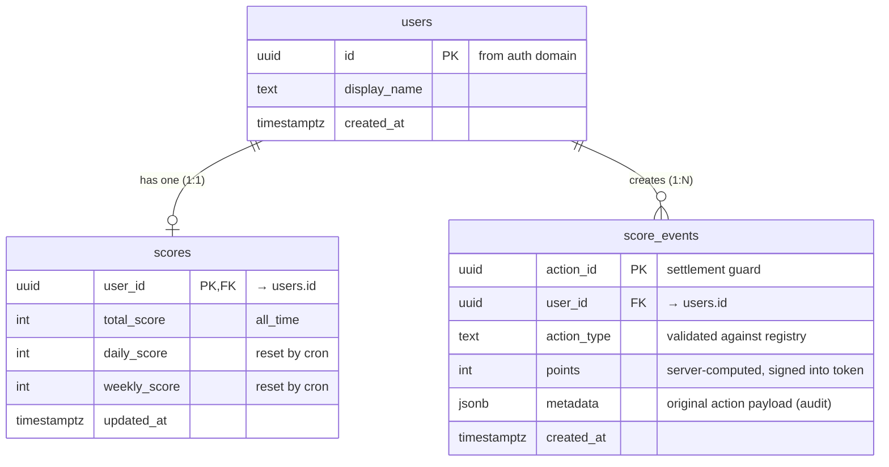
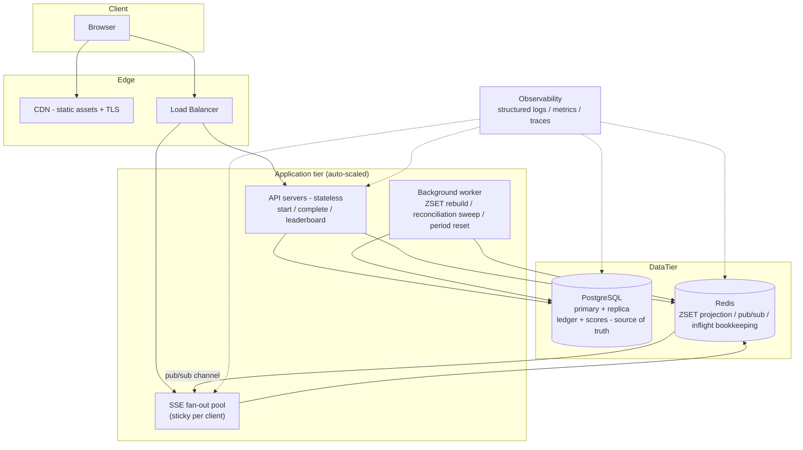

# Problem 6 — Diagrams

ER diagram, deployment topology, and the testing strategy for the live
scoreboard. The architectural decisions these diagrams express are detailed in
[`DESIGN.md`](./DESIGN.md).

## Table of contents

- [1. ER diagram](#1-er-diagram)
- [2. Deployment diagram](#2-deployment-diagram)
- [3. Testing strategy](#3-testing-strategy)

---

## 1. ER diagram

Notes:

- `score_events.action_id` **is** the anti-replay guard: it is unique by
  definition, and the insert — inside the settlement transaction — is what
  makes the credit irreversible. There is no separate nonce store anywhere.
- `scores` is a projection of `score_events` — rebuildable at any time via
  `SELECT user_id, SUM(points) FROM score_events GROUP BY user_id`.
- Ledger growth at 1k events/s peak → partition by month (T09).

---

## 2. Deployment diagram

Scaling rules of thumb:

- **API servers** scale on request rate; they are stateless, so the LB can
  round-robin.
- **SSE servers** scale on *concurrent connections* (each open connection
  holds a socket); the LB uses sticky sessions for `/api/leaderboard/stream`.
- **Redis** is the single pub/sub hub — all SSE servers subscribe, so any
  delta reaches every connected client regardless of which API server wrote
  it. If Redis is lost, only projections are affected; the ledger in Postgres
  is intact.
- **Postgres replica** serves read-heavy leaderboard rebuild queries; the
  primary takes writes only from the settlement transaction.

---

## 3. Testing strategy

### Unit tests

| Area | What is tested |
| ---- | -------------- |
| Token service | `sign`/`verify`: correct claims, expiry, wrong-secret rejection, `actionId`/`sub` binding |
| Scoring registry | action type → points mapping, unknown type rejection, per-type frequency rules |
| Settlement (mock repo) | `settle` maps `null` return from the guarded insert → `REPLAY_DETECTED`; rolls back on DB error |
| Leaderboard service | ZSET → ranked DTO mapping, rank ties, period key selection |
| Reconciliation cursor | "events newer than last applied `created_at`" query is correct and bounded |

### Integration tests (real Postgres + Redis via docker-compose)

| Test | Scenario | Assertion |
| ---- | -------- | --------- |
| Happy path | start → complete | 200, `newTotal` == previous + points, ZSET updated, SSE event published |
| Replay | complete the same `actionId` twice | 2nd call → `409 REPLAY_DETECTED`, score unchanged |
| Concurrent complete | fire 50 `complete` for one actionId in parallel | exactly one 200, 49 × 409, ledger has one row, score incremented once |
| Redis down at complete | kill Redis, complete an action | 200 — credit lands in Postgres; ZSET healed by reconciliation after Redis returns |
| Forged token | sign token with wrong secret, complete | `401 INVALID_TOKEN`, no credit, no ledger row |
| Expired token | issue token, advance clock past `exp`, complete | `401 INVALID_TOKEN`, no credit |
| Tampered points | client edits `points` claim | signature fails → `401` |
| Leaderboard | seed scores, `GET /api/leaderboard` | top-10 order, rank correctness |
| SSE reconnect | open stream, complete an action, disconnect, reconnect with Last-Event-ID | missed event replayed exactly once |
| Reconciliation | delete the ZSET, run the worker | ZSET matches the ledger aggregate exactly |

### Security / adversarial tests

| Test | Attack | Expected |
| ---- | ------ | -------- |
| Flood | 1k parallel `start` from one user | cap at 10 in-flight → `429` beyond |
| Rapid actions | complete 1k small actions instantly | frequency rule on `start` rejects above-threshold |
| ZSET tampering | write garbage into `leaderboard:*` directly | rebuild job restores from the ledger; drift alert fires |
| Cross-user replay | complete with user B's token but user A's actionId | `401` (claims bound to `sub`) |
| Ledger tampering | hand-insert a `score_events` row with a forged `action_id` | impossible without the DB; app-level: settlement re-checks token binding |

### Load test (k6 or artillery)

| Target | Value |
| ------ | ----- |
| Concurrent SSE clients | 10k |
| `complete` throughput | 1k req/s peak |
| p95 `complete` latency | < 100 ms |
| p95 SSE delta propagation | < 500 ms |
| Long-run soak | 30 min at 60% peak, no memory growth in SSE pool |
| Double-credit check | sum of credited `points` in ledger == ZSET total at the end |

### Test pyramid shape

Roughly 40 unit, 30 integration, 15 adversarial, 5 load scenarios — with the
adversarial suite wired into CI as a required gate, because the whole point of
this feature is that it survives malicious clients.
